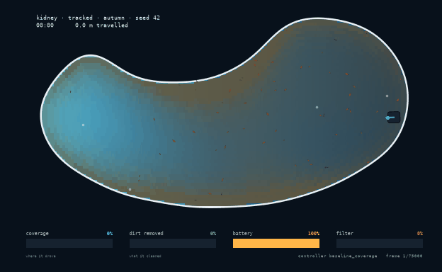
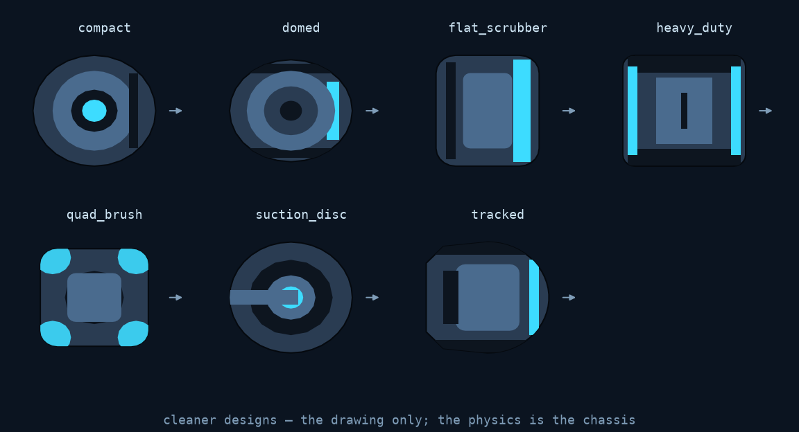
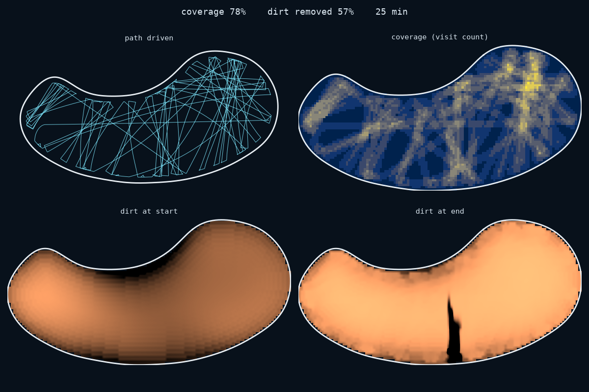
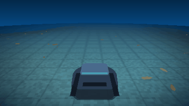
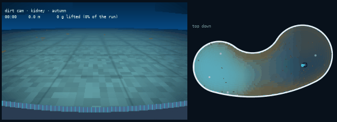
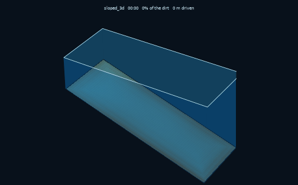
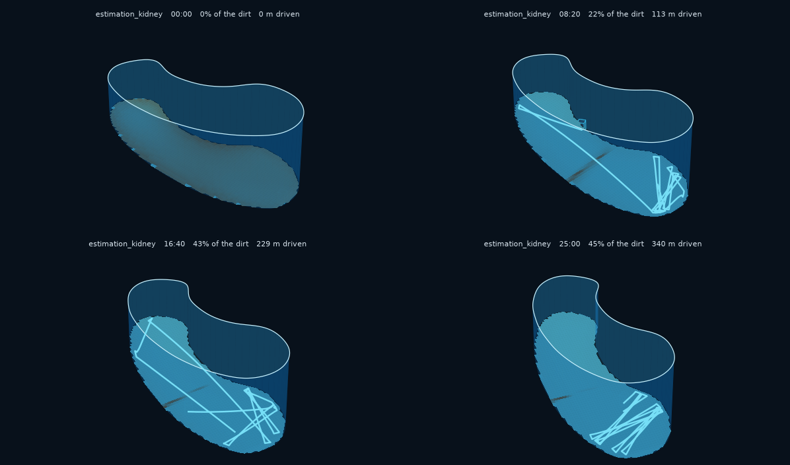
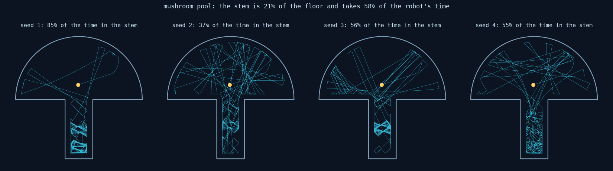

<div align="center">



# 🌊 ZimaBlue

### **Simulate, test, and replay robotic pool cleaners.**

*Driving everywhere is not the same as cleaning everything.*<br>
*ZimaBlue measures both — and lets you watch it happen.*

[](LICENSE)
[](pyproject.toml)
[](docs/architecture.md)
[](https://github.com/JGalego/ZimaBlue/actions/workflows/ci.yml)
[](https://codecov.io/gh/JGalego/ZimaBlue)
[](https://docs.astral.sh/ruff/)
[](pyproject.toml)



<sub>25 simulated minutes in a kidney pool, replayed at 260×.<br>
Watch the coverage and dirt meters drift apart.</sub>

</div>

---

Give ZimaBlue a pool, a cleaner, some dirt and a control algorithm. It
simulates the run, records it, replays it, and scores how clean the pool
actually got. That is a different question from how much of the floor the
robot drove over, and the gap between the two is what this is for.

```bash
git clone https://github.com/JGalego/ZimaBlue
cd ZimaBlue
pip install -e ".[dev]"
zimablue demo
```

No GPU. No ROS. No Docker. No Omniverse. No multi-gigabyte assets.

## What's in it

| | | |
|---|---|---|
| 🏊 | **Pools** | Eight presets, or your own Shapely outline with a pluggable depth model. Drains, skimmers, stairs and obstacles come out of the navigable area. |
| 📷 | **Pools from photographs** | Point it at a picture of a real pool and get a model. Colour rules by default, or [SAM](docs/ml.md) if you have a checkpoint. |
| 🤖 | **Cleaners** | Composed from chassis, drive, cleaning head and power. Three presets; a custom robot needs no changes to ZimaBlue. |
| 🎨 | **Cleaner designs** | Seven silhouettes so a domed suction unit does not look like a quad-brush commercial machine. Drawing only — the physics is the chassis. |
| 📡 | **Sensors that lie** | Encoders, IMU, pressure, bump switches, sonar, all through one noise, bias, latency, dropout and saturation pipeline. Faults on a schedule. |
| 🍂 | **Dirt that behaves** | Density, grain size, adhesion and pickup difficulty, settling by Ferguson & Church rather than Stokes. Seven scenarios from `clean` to `neglected_pool`. |
| 🧭 | **Controllers** | Boustrophedon coverage, random bounce, an EKF-and-occupancy-map planner, and two ground-truth oracles to bound the problem. |
| 📊 | **Metrics that disagree** | Coverage and cleanliness scored separately, each with a spatial companion. The whole point is that they rank controllers differently. |
| 🎬 | **Four ways to watch** | Top down, [chase cam](docs/replay.md), the [dirt cam](docs/replay.md) from the robot's own bumper, and a 3D basin. GIF, MP4 or an interactive window. |
| 💾 | **Reproducible recordings** | The `.zbr` format: same version, platform, scenario and seed gives a bit-identical run. Inspect it with `np.load` and no ZimaBlue. |
| 🧪 | **Experiments** | YAML scenarios, batch sweeps across seeds, aggregate stats, worst-episode reproduction, CSV and JSON out. |
| 🕹️ | **A Gymnasium environment** | Train a policy against the same simulator, then run it as an ordinary controller so it is scored like every other one. |
| 🔌 | **Runs on real hardware** | The control loop with no simulator underneath: sensor adapters, a wheel-speed loop, a watchdog. Writes the same `.zbr`. See [on a robot](docs/hardware.md). |
| 📈 | **Checked against a real robot** | The pose estimator scored against a Pioneer 3-DX's logged trajectory, not only against motion we generated ourselves. |
| 🌀 | **Dynamical-systems analysis** | Poincaré sections, transfer operators, the ergodic metric, Lyapunov divergence. Finds where a controller gets stuck rather than scoring it. See [behaviour](docs/dynamics.md). |

## Contents

- [Build a pool](#build-a-pool)
- [Add a cleaner](#add-a-cleaner) — [make it look like yours](#make-it-look-like-yours)
- [Make it dirty](#make-it-dirty)
- [Run it](#run-it)
- [Watch it](#watch-it) — [from behind](#from-behind), [from the bumper](#from-the-bumper), [in 3D](#in-3d)
- [Measure it](#measure-it)
- [Check it against a real robot](#check-it-against-a-real-robot)
- [Analyse it](#analyse-it)
- [Scale it](#scale-it)
- [Extend it](#extend-it)
- [Read more](#read-more)
- [Did you know?](#did-you-know)

## Build a pool

```python
import zimablue as zb

pool = zb.make_pool("kidney")  # rectangular · sloped · l_shaped · oval · stairs
# stadium · mushroom  (chosen for their dynamics)
```

Geometry is a Shapely polygon plus a pluggable depth model, so a sloped floor
and a flat one differ only in which model they hold. Drains, returns,
skimmers, stairs and obstacles hang off it; the blocking ones come out of the
navigable area, so coverage is measured against the floor the robot can
actually reach.

The kidney boundary is a low-order Fourier curve, which makes it smooth
everywhere — a wall follower meeting a corner behaves differently from one
tracing a curve, and a real kidney pool has no corners.

Have a photo instead of a spec? `zb.pool_from_image("backyard.jpg",
sample=(640, 410), width=8.4)` finds the water, traces its edge and scales it.
A photograph carries no scale of its own, so one real measurement is required;
for a shot taken from the poolside, four points on a rectangle you can measure
also undo the perspective, which is worth about 23% of the area. See
[imaging](docs/imaging.md).

Colour rules find the water by default. Point `segmenter=SamSegmenter.load(...)`
at a SAM export and a model finds it instead — worth it for a black-bottomed
pool, or one half in shade. On a drone photo the two agree to 3.7%, which is a
reasonable amount of confidence in both. See [machine learning](docs/ml.md).

In a notebook, `zb.preview(pool)` renders it in the browser — drag to rotate,
scroll to zoom. The pool's geometry is shipped to the page as JSON and
projected there, so it needs no widget extensions and keeps working in an
exported HTML file. Hand it a finished run and it tints the floor with the
dirt left behind and draws the path that was driven.

## Add a cleaner

Cleaners are built from components:

```python
robot = zb.Cleaner(
    chassis=zb.Chassis(length=0.45, mass=10.5),
    cleaning=zb.CleaningSystem(
        brush=zb.Brush(width=0.38, aggressiveness=1.2),
        filter=zb.Filter(capacity=1200.0, mesh=45e-6),
    ),
    sensors=[zb.Encoder(), zb.IMU(), zb.Sonar(beam_angles=(0.0, 0.7, -0.7))],
)
```

Encoders, IMU, pressure/depth, contact and sonar share one pipeline of sampling
rate, noise, bias with random walk, latency, quantisation, saturation, dropout
and stuck values. Encoders report *wheel* speed, so odometry drifts because
the wheels really do slip; no error is injected to make it happen.

You can break a sensor on purpose:

```python
robot.sensors.sonar.inject_fault(
    bias=0.15,  # reads 15 cm long
    dropout_probability=0.02,  # loses 2% of pings
    start_time=300.0,  # ...starting five minutes in
)
```

### Make it look like yours

<div align="center">

</div>

```python
robot = zb.make_robot("tracked")
robot.design = zb.make_design("quad_brush")
```

Seven archetypes, named by form rather than by product, because the form is
the useful abstraction and a library has no business shipping traced outlines
of somebody's industrial design. To match a specific machine, measure it:

```python
from zimablue.robot import CleanerDesign, Part
from zimablue.robot.design import ellipse, bar

mine = zb.Cleaner(
    name="mine",
    design=CleanerDesign(
        name="mine",
        body=ellipse(0.5, 0.44),
        parts=(Part(bar(0.34, 0.30, 0.09), colour="#3ddcff", lift=0.05, name="brush"),),
    ),
)
```

Coordinates run −0.5 to 0.5 and are scaled by the chassis, so any design fits
any robot. **It is a drawing and nothing else.** Collision uses the chassis
rectangle, cleaning uses the swath width, traction uses the mass — swapping a
design changes every rendered pixel and not one number in the metrics. A
drawing that quietly moved the results would be the worst kind of bug, so
there is a test that a run scores identically whichever design it wears.

## Make it dirty

Dirt carries density, particle size, adhesion and a settling velocity derived
from the Ferguson–Church equation — 350 µm sand comes out at 47.6 mm/s against
a measured ~45. Sediment and algae live in continuous rasters; leaves and twigs
are discrete items, some too big for the intake to swallow.

Removal is gated by how much agitation breaks the bond, so the brush matters
more the more adhered the dirt is: ~1.0× for sand, 2.2× for algae, 3.5× for
biofilm. Turn the brush off and a robot can drive over algae all day.

## Run it

```python
sim = zb.Simulation(pool="kidney", robot="tracked", dirt="autumn", seed=42)
result = sim.run(minutes=30)

print(result.metrics.summary())
result.save("runs/example.zbr")
```

```
  coverage            80.8 %   (walls 79 %)
  dirt removed        58.0 %   (581 g of 1002 g)
  uniformity          74.4 %
  revisits            1.95   extra passes/cell
  distance           384.9 m
  runtime             30.0 min
  energy              33.3 Wh   (battery 72 % left)
  collisions           468
  stuck                  0 events, 0.0 s
```

Driving it is a boustrophedon baseline, a random-bounce floor, a map-building
`systematic` controller, or one of two ground-truth oracles that are
explicitly *not* deployable: `lawnmower_oracle` drives a perfect path and
`dirt_oracle` heads for whatever is dirtiest. Yours needs a class with `reset`
and `step`, and sees sensor readings only.

Or train one. `zimablue[rl]` puts a Gymnasium env over the same loop, at 24×
real time on one core with no GPU, and the reward is the experiment: pay for
coverage and you get a policy that drives beautifully over dirt it never picks
up. See [machine learning](docs/ml.md).

`systematic` runs an EKF over position, heading and **gyro bias**. The bias is
only observable when the robot stops — a stationary gyro's reading *is* its
bias — so zero-velocity updates are what keep heading from fanning out over
half an hour.

Run the same version on the same platform, with the same scenario and seed,
and you get the exact same recording every time. That comes from a fixed
timestep, no wall-clock reads while stepping, and one seeded RNG tree whose
named streams mean adding a sensor never shifts another's noise. `.zbr` is a
ZIP of a JSON manifest, columnar `npz` frames, sparse events and dirt
keyframes — unzip it and read it with `numpy.load`. Pool geometry and robot
config are embedded, so a recording stays replayable after the preset it came
from changes.

## Watch it

<div align="center">

</div>

```bash
zimablue replay runs/example.zbr
```

Playback runs at 0.25× to 25×, with pause, scrub, step and speed control; 1×
plays the run at the speed it happened. The cleaned swath is drawn *under* the
dirt, so a patch the robot drove over but failed to clean still looks dirty.
Sonar beams, wall contacts, battery and filter fill are all on screen, and if
the controller publishes a pose estimate it appears as an amber ghost drifting
away from the true position.

Headless? `zimablue replay run.zbr --gif out.gif`.

### From behind

<div align="center">


<sub>Chase cam. Close enough to see the brushes, far enough to see the swath.</sub>
</div>

```bash
zimablue replay runs/example.zbr --chase --gif out.gif
```

The other two views each hide something. From above the robot is a postage
stamp, so you read the path and lose the machine. From the bumper you never see
the machine at all. A metre back and half a metre up you get both, and because
the robot is now in front of the camera it has to be drawn — from its own
design, so a domed suction unit and a quad-brush commercial machine look like
different machines.

The camera follows with lag. Bolt it rigidly and a turn reads as the *pool*
rotating, which is disorienting and wrong; let its heading chase the robot's
and the turn reads as the robot swinging across frame.

### From the bumper

<div align="center">


<sub>Dirt cam, with the top-down view alongside. The two disagree constantly.</sub>
</div>

```bash
zimablue replay runs/example.zbr --dirtcam --gif out.gif
```

Watching from above is calming. From 18 cm off the floor the same pool is a
silt plain with leaves in it, which is closer to what a cleaner is driving
through. From above you see where the robot went; from down here you see what
it left behind.

It is inverse perspective mapping over the same dirt raster the metrics are
computed from — one NumPy expression per frame across a grid of rays, no 3D
engine involved.

### In 3D

<div align="center">


<sub>A sloped pool: 1.0 m at the shallow end, 2.4 m at the deep end.</sub>


</div>

```bash
zimablue replay runs/example.zbr --3d --gif out.gif
```

The floor is a surface built from the pool's depth model, the walls are
extruded from its boundary, and the robot sits at the local floor depth — so in
a sloped pool it really is metres lower at the deep end. The camera orbits
slowly for parallax, and vertical scale is exaggerated about 3.6× because a
12 m pool 2 m deep is otherwise a pancake.

This renders in 3D; it does not simulate in 3D. The motion still comes from
the 2D backend. A 3D *backend* — buoyancy, contact, wall climbing, cameras — is
designed but not built, and the [roadmap](docs/roadmap.md) says so.

## Measure it

Coverage is where the robot drove. Cleanliness is what it removed. They come
apart, and most simulators will not tell you so.

The oracle makes it obvious. Over 30 minutes in a kidney pool:

| controller | coverage | dirt removed | distance |
|---|---|---|---|
| `lawnmower_oracle` (ground truth) | **88.3%** | 33.3% | 180 m |
| `random_bounce` | 84.7% | 44.8% | 393 m |
| `baseline_coverage` | 80.8% | **58.0%** | 385 m |

The ranking inverts completely. Best coverage is worst cleaning, and worst
coverage is best cleaning. The oracle drives a perfect path, finishes early and
stops; the scrappier controllers keep going over the same adhered dirt, which
is what actually removes it. Report only coverage and you get the order exactly
backwards.

Better localisation currently makes things worse. Calibrating the odometry
improves the mapping controller's position estimate fivefold and halves its
coverage.

| `encoder_scale` | position error | coverage |
|---|---|---|
| 1.00 (uncalibrated) | 13.7 m | **73.9%** |
| 0.94 (calibrated) | **3.8 m** | 52.6% |

The estimator is not at fault — 3.8 m after 340 m of travel with no absolute
reference is respectable dead reckoning. The planner is. With a poor estimate
the lane plan is effectively randomised and the robot wanders widely, covering
ground the way random bounce does; with a good one it runs short disciplined
lanes and spends its time turning. Coverage is being won by accident, and
fixing that is the top [roadmap](docs/roadmap.md) item.

## Check it against a real robot

Those numbers all come from motion this package generated, judged against
ground truth it also generated. That is unfalsifiable, so there is now a path
that is not.

```bash
python tools/fetch_trajectory.py --all
python examples/replay_real_trajectory.py
```

A Pioneer 3-DX driving a real building, tracked at 300 Hz by a real motion
capture rig. The shipped sensor models are driven from that motion and the
estimator is scored against where the robot actually was:

| log | drove | final error | mean | worst |
|---|---|---|---|---|
| `pioneer_360` | 17.0 m | 0.18 m | 0.22 m | 0.44 m |
| `pioneer_slam` | 42.5 m | 0.15 m | 0.34 m | 1.08 m |
| `pioneer_slam2` | 23.3 m | 2.16 m | 0.86 m | 2.17 m |

The motion is real, including a full second where the tracker lost the robot.
The sensors are not — the noise is still ours — and there is no slip, so the
estimator is being flattered in a known direction. Even so it says something
the table above could not: the 13.7 m of drift is the slip model's doing, not
a real trajectory being hard to integrate. And `pioneer_slam2` ends 39° out on
heading because the gyro bias is only observable when the robot stops, and
that one rarely does.

The whole control loop runs on real hardware too, through the same
`ControlInput` and `DriveCommand` a controller already sees. See
[on a robot](docs/hardware.md).

## Analyse it

Coverage and cleanliness say what a run achieved. They say nothing about
*how* the robot behaved — whether it repeated itself, how fast it forgot where
it started, whether the room was doing the work.

```python
from zimablue.dynamics import transfer_operator, ergodic_score

operator = transfer_operator([run_a, run_b, run_c])
print(operator.summary())  # mixing rate
labels = operator.almost_invariant_sets(2)  # where it gets stuck
```

<div align="center">


<sub>The <code>mushroom</code> pool. Same controller, same code, four seeds.</sub>
</div>

The stem is 21% of the floor and takes 58% of the robot's time — 85% on one
seed and 37% on another. Nothing about the algorithm causes that spread; the
room does. `mushroom` and `stadium` are pool presets chosen for their billiard
dynamics: one is a provable trap, the other provably ergodic.

The transfer operator finds the trap without being told the shape of the pool,
and the [ergodic metric](docs/dynamics.md) catches something coverage
structurally cannot — `lawnmower_oracle` achieves the best distribution of any
controller at twelve minutes, then finishes, parks, and spends the rest of the
cycle making it worse.

Two predictions this exercise proved wrong are written up in
[behaviour](docs/dynamics.md), because they were made in public first.

## Scale it

```bash
zimablue run   kidney --record runs/kidney.zbr        # a bundled scenario
zimablue run   scenarios/autumn_kidney.yaml           # or your own file
zimablue batch kidney --episodes 100 --out results.json
```

A scenario is YAML: pool, robot, dirt, controller, seed, duration, termination.
Batches vary the seed and aggregate, keeping enough metadata to reproduce any
individual failure exactly.

## Extend it

Commercial pool cleaners are evaluated by driving them around a real pool with
real dirt: slow, expensive, impossible to repeat. Meanwhile Gazebo, MuJoCo and
Isaac Sim each make *their engine* the API, so anything pool-specific you build
cannot outlive the engine.

Here the domain model is the API. Pools, dirt, cleaners, scenarios, recordings
and metrics are ZimaBlue concepts. Whatever integrates the equations sits
behind an interface and can be swapped — today it is a deterministic CPU-only
2D backend running at 25–30× real time on one core.

```
                         ZimaBlue domain API
                                 │
              ┌──────────────────┼──────────────────┐
        World model         Robot model         Controller
     pool · water · dirt   body · sensors      (replaceable)
              └──────────────────┼──────────────────┘
                                 │
                        SimulationBackend
                                 │
                  ┌──────────────┴──────────────┐
             Fast2DBackend                IsaacSimBackend
              (CPU, today)                  (planned)
                                 │
                    Recording · Replay · Metrics
```

A backend owns dynamics and sensing, nothing else. Dirt accounting, metrics and
recording are computed by shared code from the state it returns, so a new
backend inherits them and cannot redefine how they are measured. A `.zbr`
written by the 3D backend will have to replay in the 2D viewer; that is the
acceptance test.

Pools, robots, dirt, controllers and backends are all registries, so adding one
means writing a function. Issues and pull requests welcome — see
[`CONTRIBUTING.md`](CONTRIBUTING.md), which is mostly about not breaking
determinism and preferring a small real model to a large fake one.

## Read more

| | |
|---|---|
| [Getting started](docs/getting-started.md) | Install, first run, common tasks |
| [From a photo](docs/imaging.md) | Tracing a pool out of a picture, and what a picture cannot tell you |
| [Machine learning](docs/ml.md) | SAM for the water mask, Gymnasium for the controller |
| [On a robot](docs/hardware.md) | Running a controller on real hardware, and testing it against real logs |
| [Behaviour](docs/dynamics.md) | Periodic orbits, mixing rates, the ergodic metric, and two pools chosen for their dynamics |
| [Architecture](docs/architecture.md) | Layering, backends, determinism contract |
| [Research](docs/research.md) | Prior art, and which decision each finding drove |
| [References](docs/references.md) | Verified bibliography, with what the code implements |
| [Scenarios](docs/scenarios.md) | YAML experiments and batch sweeps |
| [Recording](docs/recording.md) | The `.zbr` format, channel by channel |
| [Replay](docs/replay.md) | Controls, exporters, rendering notes |
| [Roadmap](docs/roadmap.md) | Done, next, and deliberately not planned |
| [Releasing](RELEASING.md) | Publishing to TestPyPI and PyPI |

### Examples

Every one takes `--minutes` if you want a shorter run.

| | |
|---|---|
| [`basic.py`](examples/basic.py) | The smallest useful program: pool in, metrics out |
| [`custom_pool.py`](examples/custom_pool.py) | Build a pool from geometry, depth models and features, then read the spatial metrics |
| [`pool_from_photo.py`](examples/pool_from_photo.py) | Trace a pool out of a photograph, check the trace, then clean it — `--sam` to segment with a model |
| [`rl_env.py`](examples/rl_env.py) | The Gymnasium env, and the baseline a trained policy has to beat |
| [`tune_controller.py`](examples/tune_controller.py) | Search the shipped controller's parameters, which is the cheap thing to try first |
| [`train_policy.py`](examples/train_policy.py) | Train a controller with PPO, score it against the shipped ones, and replay it |
| [`custom_robot.py`](examples/custom_robot.py) | Compose a cleaner from components and break a sensor on purpose |
| [`custom_controller.py`](examples/custom_controller.py) | Write an autonomy stack and benchmark it against the shipped ones |
| [`estimation_replay.py`](examples/estimation_replay.py) | The EKF controller, with the pose estimate drawn against ground truth |
| [`batch_experiment.py`](examples/batch_experiment.py) | Run a scenario across seeds, then reproduce its worst episode exactly |
| [`replay.py`](examples/replay.py) | Replay a recording flat, in 3D, from the bumper, or interactively |
| [`replay_real_trajectory.py`](examples/replay_real_trajectory.py) | Score the estimator against a real robot's logged trajectory |
| [`analyse_dynamics.py`](examples/analyse_dynamics.py) | Periodic orbits, mixing rates, the ergodic metric and sensitivity, for one pool |
| [`tour.ipynb`](examples/tour.ipynb) | All of the above in one notebook, with the pool turnable in the browser |

## Did you know?

That sharp "chlorine" smell at a busy pool is mostly not chlorine, and the red
stinging eyes are not chlorine's fault either. Chlorine reacts with what
swimmers bring in with them — sweat, skin cells, sunscreen, and yes, pee — and
the chloramines that come out of the reaction are what you smell and what
stings. A pool that reeks is a pool that has been swum in. So shower first,
and use the toilet before you get in.

ZimaBlue models sand, algae, biofilm and leaves. Swimmers are out of scope.
([CDC](https://www.cdc.gov/healthy-swimming/prevention/preventing-eye-irritation-from-pool-chemicals.html))

## License

[MIT](LICENSE).
