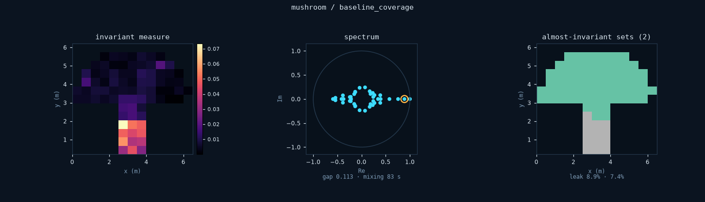
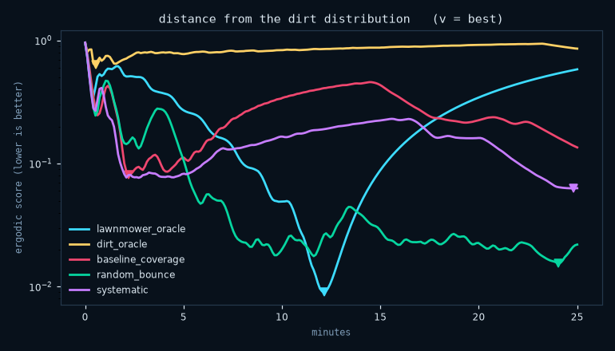
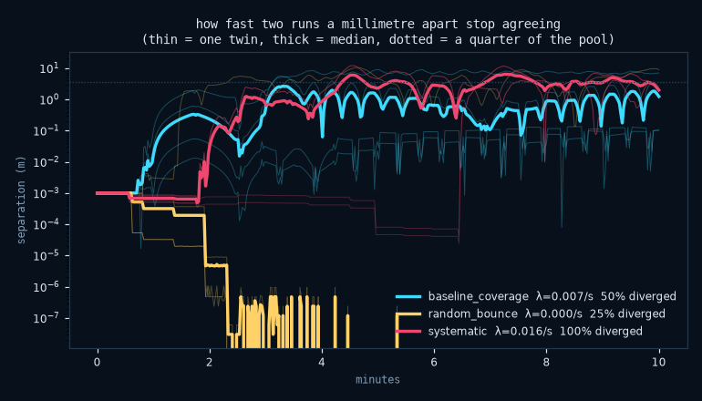
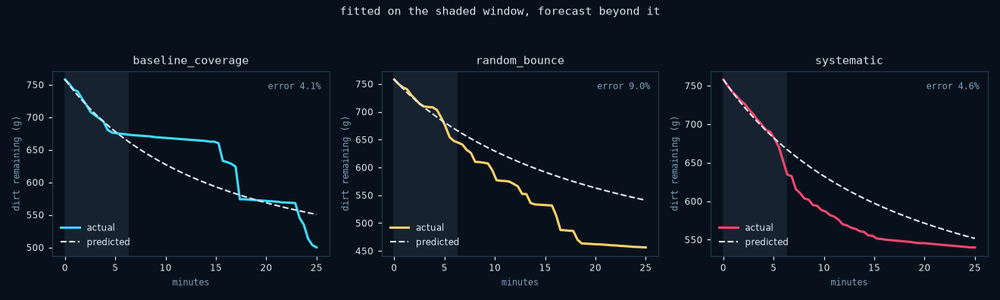

# Behaviour over time

Most ZimaBlue metrics describe the result of a run: floor covered, dirt
removed, distance and duration. This module examines the robot's motion over
time. It finds repeated paths, measures how quickly initial conditions are
forgotten, compares the path with a target distribution and estimates a useful
prediction horizon.

```python
from zimablue.dynamics import return_map, transfer_operator, ergodic_score
```

A cleaner is a hybrid dynamical system. Continuous differential-drive flow
inside a bounded domain, punctuated by discrete events — wall impacts, planner
mode switches, getting stuck — and coupled to a slowly-varying field it
consumes. Each module here points one classical tool at one part of that.

Everything reads finished recordings, except `divergence`, which has to run the
perturbed twins itself.

## The Poincaré section

```python
section = return_map(recording)
for orbit in section.periodic_orbits():
    print(orbit.describe())
print(f"{section.trapped_fraction():.0%} of the run on an attracting orbit")
```

Unroll the pool wall to arc length, record the incidence angle at every
contact, and a twenty-minute run collapses from ninety thousand frames to a few
dozen points on a cylinder. A recurring point is a periodic orbit — the robot
doing the same loop forever — and if it is *attracting*, the robot falls into
it and coverage stops improving while every dashboard still says the machine is
working.

Some implementation choices are not details.

**Contacts are debounced.** In a real run, 69% of raw bump-switch rising edges
land less than half a second after the previous one: the robot bumps, backs off
a few centimetres, bumps again. Counting those as separate arrivals filled the
section with "period-1 orbits lasting zero seconds" — chatter dressed up as
dynamics. A contact is new if it is more than 1.5 s after the last one *or*
more than 0.6 m further along the wall, the second clause because in a narrow
channel the robot really does touch opposite walls a moment apart.

**Incidence is measured from the outward normal.** 0 is driving into the wall,
±90° is sliding along it. Two earlier conventions each put every contact in the
same half of the range and wasted the axis.

**What we found: almost nothing.** Across every pool and controller tried, the
detector reports repelling orbits lasting tens of seconds and a trapped
fraction of zero or one per cent. With this noise model, sustained traps do not
occur. That is a real answer and not a
broken tool — the detector is verified against a synthetic periodic section in
[`tests/test_dynamics.py`](../tests/test_dynamics.py), including that the sign
of the multiplier comes out right.

The section's true state is not `(s, theta)` — the controller carries an EKF, a
map and a lane plan — so a recurrence found here is evidence of a periodic
orbit, not proof of one.

## The transfer operator

```python
operator = transfer_operator([run_a, run_b, run_c], cell=0.75, lag=10.0)
print(operator.summary())
labels = operator.almost_invariant_sets(2)
print(operator.leak_rate(labels))
```

Chop the pool into cells and count how often a robot in cell *i* is in cell *j*
a lag later. That matrix discretises the Perron–Frobenius operator, and its
spectrum answers three questions coverage cannot: **where the robot ends up**
(leading eigenvector), **how fast it mixes** (spectral gap), and **where it
gets stuck** (sub-leading eigenvectors).

The third is the one that pays. On an L-shaped pool it separates the two arms,
with the boundary at the inside corner. On the mushroom it isolates the stem.
Neither was told the shape of the pool.

<div align="center">

</div>

Note where the mushroom's partition falls: **y ≈ 2.7, not the geometric neck at
3.25**. Lower, inside the stem. That is correct and it is the point — the robot
moves through the top of the stem freely, and it is the bottom it cannot leave.
Almost-invariant sets find where the traffic is thin, which is a different
place from where the walls are.

Traps in the estimate, each hit while building this:

- **Unvisited cells must be dropped, not made absorbing.** Each self-looping
  cell contributes an eigenvalue of exactly 1. Twenty-one unreachable cells in
  an L-shaped pool put twenty-one spurious ones at the top of the spectrum and
  the second eigenvalue — the entire point — vanished underneath them.
- **A mixing time longer than the run is an extrapolation.** Check
  `operator.reliable` before quoting one. A twenty-five-minute run reporting a
  two-hour mixing time is telling you it never got there.

A Markov model assumes the next cell depends only on the current one, and this
robot has memory. The operator is a projection onto the spatial coordinates,
and the rate it reports is that projection's.

## The ergodic metric

```python
score = ergodic_score(recording, target="dirt")
print(score.describe())
```

[Mathew and Mezić][mm] define a trajectory's ergodicity against a target
distribution as a Sobolev distance between the fraction of time spent in each
region and the fraction of the target that lives there. Expand both in a
Fourier basis and it is a weighted sum over modes, with coarse structure
weighted above fine.

The choice that matters is the target. Uniform gives you coverage. **Make the
target the dirt density and it becomes cleanliness** — one number for "spend
time in proportion to how dirty it is". This project's whole argument, in the
formalism that already existed for it.

<div align="center">

</div>

The shape is the result. `lawnmower_oracle` reaches **0.0091 at twelve
minutes**, the best distribution any controller here achieves, and then
climbs to 0.58 as it finishes and parks, producing a V-shaped curve.
`dirt_oracle` peaks thirty seconds in and degrades for 98% of the run, which is
what a greedy policy looks like from this angle: it goes where the grams are
and then keeps going back. `random_bounce` and `systematic` are the two still
improving at the cutoff, and they are the two with no idea where the dirt is.

The metric reveals this **because it is not monotone**. Coverage and dirt
removed can only rise, so neither can show a robot spending the second half of
its battery making its distribution worse. The ergodic score can, and
`score.wasted` puts a number on it.

## Divergence

```python
run = divergence(controller="baseline_coverage", pool="kidney", minutes=20)
print(run.describe())
```

Start the same robot a millimetre apart and watch the gap. The rate bounds how
far a rollout of this simulator means anything — past `1/lambda` seconds a
trajectory is a plausible sample and not a forecast, which is the rigorous
version of the warning in [`ml.md`](ml.md).

**The result inverts the obvious guess.** `random_bounce` is the *least*
sensitive controller, not the most:

| controller | lambda | twins that ended a quarter-pool apart |
|---|---|---|
| `systematic` | 0.0161 /s | 100% |
| `baseline_coverage` | 0.0067 /s | 50% |
| `random_bounce` | ~0 | 25% |

The reason is that random bounce draws its turn angles from a seeded generator
rather than from the state, so twins sharing a seed make identical choices,
while both planners' decisions depend on where the robot is and compound. The
expected "chaos mixes, so high lambda buys coverage" trade-off does not appear.

`systematic` is the most sensitive of the three by a factor of two, and every
one of its twins ended up a quarter-pool apart. That is the map compounding on
top of the estimate: two robots a millimetre apart write slightly different
walls, then plan against them.

Read that as a statement about the *deterministic skeleton* of random bounce.
On hardware the noise is independent and it would diverge.

<div align="center">

</div>

Implementation notes, each from getting it wrong first. The start pose
comes from `Simulation.start_pose`, not from frame zero of the recording —
frame zero is written after the first step and stored as float32, which
displaced every twin by a third of a millimetre before the perturbation was
applied. And the summary is a **median** over twins, because the outcomes are
bimodal: pushed along a lane the controller absorbs it, pushed across one it
compounds, so a mean reports a value no twin ever had. `diverged` — the
fraction that ended a quarter-pool apart — is the more robust number.

## Averaging

```python
forecast = forecast_cleaning(recording, fit_fraction=0.25)
print(forecast.describe())
```

The robot moves at 0.3 m/s and the dirt changes over tens of minutes. Averaging
theory replaces the exact path on this slow timescale with the *fraction of
time spent in each place*. Fit an effective removal rate on the first few
minutes of occupancy and predict the rest.

<div align="center">

</div>

Fit six minutes, predict nineteen: `baseline_coverage` 4.1% error,
`systematic` 4.6%, `random_bounce` **9.0%**. So occupancy density really is a
sufficient statistic — near enough, for a controller whose strategy holds
still. Where it is not, the error says so: a fit made during one strategy and
spent on another is exactly what a large error means, which makes this a
strategy-change detector as much as a predictor.

## Pools chosen for their dynamics

```bash
zimablue run stadium --minutes 20
zimablue run mushroom --minutes 20
```

`stadium` is [Bunimovich's][bun79]: a rectangle capped with two half-discs,
whose billiard flow is provably chaotic and ergodic. It is the control case —
a robot covers it well *because of the room's shape*, and comparing against the
rectangle separates the room's contribution from the controller's.

`mushroom` is [the other one][bun01], and it is a trap made of geometry. Its
phase space is divided: a set of trajectories that stay in the cap forever, and
a chaotic set that visits both, with nothing in between.

<div align="center">

</div>

The stem is **21% of the floor and takes 58% of the robot's time**. Per seed:
85%, 37%, 56%, 55% — same controller, same pool, same code. Nothing about the
algorithm causes that spread. It is the room.

Not a fantasy shape, either: an L-shaped pool with a narrow neck to a spa is
the same topology with corners.

## What this cost us in honesty

Predictions made before implementing, both wrong, both left in the record:

**The spectral gap does not explain the localisation paradox, and there was no
paradox.** The claim was that calibrating the odometry slows mixing and that is
why coverage falls. Measured across four `encoder_scale` values, coverage
tracked **distance travelled** far better than mixing time — which should have
been the tell, since a controller with twenty-five minutes of battery has no
business travelling 71 m. It was not mixing and it was not planning: the
occupancy map could never unmark a wall, so spurious walls stamped from a
drifting estimate slowly fenced the robot in and it stopped early. With that
fixed the effect is gone entirely. Two tidy stories for one bug.

**Random bounce is the predictable one**, as above.

[mm]: https://doi.org/10.1016/j.physd.2010.10.010
[bun79]: https://doi.org/10.1007/BF01197884
[bun01]: https://doi.org/10.1063/1.1418763
