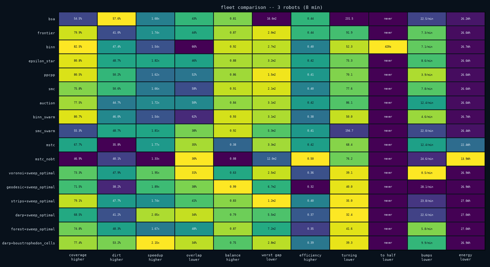
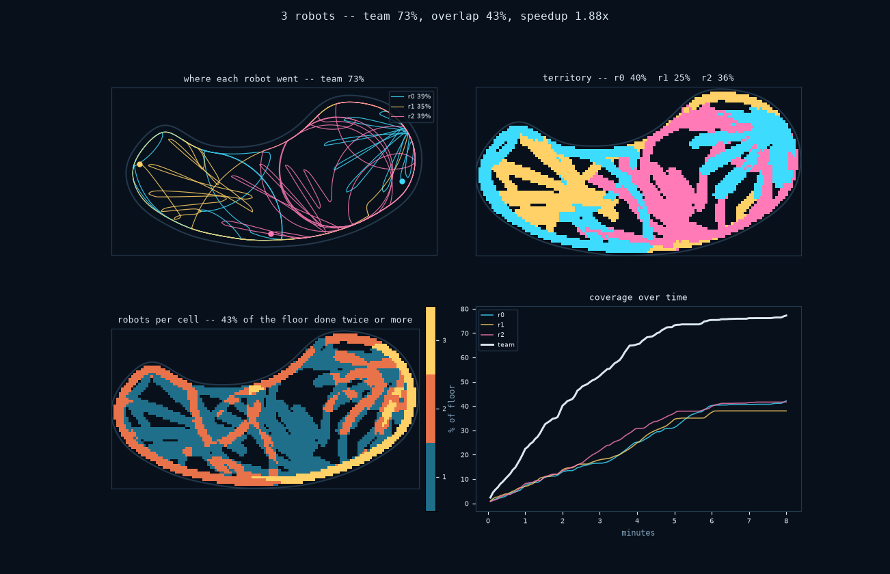

# Fleets

Adding a second robot changes the run. Both robots share one dirt field, so the
later arrival may find a patch already clean. They also compete for space and
must communicate anything they know about each other.

```python
import zimablue as zb

fleet = zb.Fleet(pool="kidney", robots=3, controllers="auction")
result = fleet.run(minutes=20)
print(result.summary())
```

```
  robots            3
  team coverage       90.7 %
  dirt removed        62.7 %
  overlap             83.7 %   (floor two or more robots both did)
  speedup             1.25 x   (against the best single member)
  balance             0.85     (shortest run / longest)
  distance           636.3 m  (all robots)
  encounters           136     (robot-on-robot)
  per robot         r0 65%  r1 60%  r2 73%
```

Coverage is the least interesting number there. **Speedup** — team coverage
over the best single member's — has a ceiling equal to the robot count, and how
far short it falls is the cost of sharing a pool. **Overlap** is the floor more
than one robot did. **Balance** catches the failure coverage hides completely:
one robot doing the work while another finishes early and parks.

## How it is put together

`Fleet` composes the single-robot machinery rather than replacing it. Each
robot gets its own backend, its own sensors and its own controller; all of them
are reset against **one** `World`, which is what makes the dirt shared. Nothing
in the single-robot path changed, and `Simulation` is still the right thing for
one robot.

What is new is everything between the robots.

**They collide.** Every backend is told where the others are before each tick,
as discs. The collision resolver pushes them apart and the sonar sees them, so
`Contact.is_robot` distinguishes bumping a team-mate from bumping the wall — a
fleet logging a hundred of the first is telling you something a lumped
collision count cannot.

**They talk, badly.** The `Blackboard` is a radio, not a god view. A robot
publishes *its own estimate* of where it is and what it has covered, so a fleet
inherits every member's localisation error and then has to coordinate through
it. `comms_range` limits who hears whom; the default is unlimited only because
that is what almost every published algorithm assumes.

**Sense all, decide all, then move all.** Not sense-decide-move per robot in
turn, which would let robot 1 react to robot 0's *new* position inside the same
tick — a turn-order advantage that grows with the fleet and makes the result
depend on the order the robots happen to be listed in.

### The recording

A fleet writes one `.zbr` with every robot's channels prefixed — `r0.x`,
`r1.heading` — and robot 0's channels *also* written flat as `x`, `heading`.
The duplication is deliberate. Every tool in the package reads the flat names,
and aliasing them to the first robot means the replay window, the dirt cam, the
dynamics module and the planner comparison all open a fleet recording and
follow one member, instead of refusing to open it.

## Dividing the pool

Most multi-robot coverage in the literature is one idea: cut the area into as
many pieces as there are robots, then run a single-robot planner in each. Each
way of cutting fails differently:

| | | fairness on a kidney, 3 robots |
|---|---|---|
| `voronoi` | nearest robot wins, in a straight line | 0.51 |
| `geodesic` | nearest robot wins, through the water | 0.54 |
| `strips` | equal-area bands across the long axis | 0.99 |
| `darp` | iterate until the shares are equal | 0.96 |
| `forest` | split a spanning tree into balanced subtrees | 0.82 |

Fairness is the smallest share over the largest. `voronoi` hands the robot in
the waist of a kidney a third of what the robot in a lobe gets, and it will
happily assign a cell on the far side of a wall because the crow flies across
the concavity. `geodesic` fixes the wall and not the fairness. `darp`
(Kapoutsis et al., 2017) iterates a multiplier per robot until both are right,
and reports whether it converged. `forest` cannot produce a disconnected share
because it cuts a tree, not a map.

Every territory becomes a small `Pool`, so every offline planner works
inside one unchanged:

```python
from zimablue.planners import partitioned

zb.Fleet(pool="kidney", robots=3, controllers=partitioned("darp", "sweep_optimal")).run(minutes=20)
```

### A partition is only as good as the localisation that drives it

The same DARP partition, the same plans, the same pool, eight minutes, three
robots — followed from the true pose and from dead reckoning:

| | team coverage | overlap | speedup |
|---|---|---|---|
| `localisation="truth"` | 60.7% | 0.3% | **2.92x** |
| `localisation="odometry"` | 68.5% | 33.6% | 2.05x |

On truth the division of labour is nearly perfect: 2.92 of a possible 3.0, and
three tenths of one per cent of the floor done twice. On dead reckoning the
partition survives in the plan and has evaporated in the execution — the robots
drift into each other's territories and a third of the pool gets done twice.

And coverage goes **up**, because the drifting robots wander into the margin
along the wall that the plans never covered. The same effect the `systematic`
controller shows on one robot, at fleet scale: better localisation does not
help until the planner can spend it.

## Coordinating without dividing

| | |
|---|---|
| `mstc` | one spanning-tree circuit cut into arcs; a finished robot takes over a tail |
| `mstc_nobt` | the same circuit and arcs, without backtracking |
| `auction` | bid for the next cell; the cheapest robot gets it |
| `binn_swarm` | the neural field, with team-mates as inhibition |
| `smc_swarm` | one ergodic time-average, shared across the fleet |

One more needed no code at all. Every online planner becomes cooperative
when the fleet hands it a blackboard: it publishes what it has covered and
skips what its team-mates say they have done. `Fleet(..., share=True)` is that,
it is the default, and it is the baseline the methods above have to beat.

### What the measurements said

Three robots, kidney pool, eight minutes, one seed. The same harness as the
single-robot comparison, with the dimensions that only mean something for a
team -- speedup, overlap, balance -- in place of the ones that do not.

<div align="center">

</div>

```
                             coverage       dirt    speedup    overlap    balance  worst gap efficiency    turning    to half      bumps     energy
---------------------------------------------------------------------------------------------------------------------------------------------------
bsa                             54.5%     *57.6%      1.68x        43%       0.81     16.6m2       0.44      231.5      never   22.5/min     26.2Wh
frontier                        79.9%      41.0%      1.74x        44%       0.87      2.0m2       0.44       91.9      never    7.3/min     26.6Wh
binn                           *82.5%      47.4%      1.54x        66%       0.92      2.7m2       0.40       52.3      *420s    7.1/min     26.7Wh
epsilon_star                    80.8%      48.7%      1.82x        46%       0.88      3.2m2       0.42       75.3      never    8.6/min     26.6Wh
ppcpp                           80.5%      50.2%      1.62x        52%       0.86      1.5m2       0.41       70.1      never    3.9/min     26.6Wh
smc                             75.8%      50.6%      1.66x        58%       0.91      2.1m2       0.40       77.6      never    7.8/min     26.6Wh
auction                         77.5%      44.7%      1.72x        50%       0.84      3.1m2       0.42       86.1      never   12.4/min     26.6Wh
binn_swarm                      80.7%      46.0%      1.54x        62%       0.93      3.1m2       0.38       50.0      never    4.6/min     26.7Wh
smc_swarm                       55.3%      48.7%      1.81x        38%       0.92      5.3m2       0.41      194.7      never   22.0/min     26.4Wh
mstc                            67.7%      35.8%      1.77x        35%       0.38      3.3m2       0.42       68.4      never   12.4/min     22.4Wh
mstc_nobt                       46.9%      40.1%      1.33x       *30%       0.08     12.0m2      *0.50       76.2      never   24.6/min    *13.9Wh
voronoi+sweep_optimal           73.3%      47.9%      1.95x        31%       0.63      2.5m2       0.36       39.1      never   *0.5/min     26.9Wh
geodesic+sweep_optimal          71.5%      38.2%      1.89x        38%      *0.99      6.7m2       0.32       40.0      never   28.1/min     26.9Wh
strips+sweep_optimal            79.1%      47.7%      1.74x        41%       0.83     *1.2m2       0.40       35.0      never   23.8/min     27.0Wh
darp+sweep_optimal              68.5%      41.2%      2.05x        34%       0.79      5.5m2       0.37      *32.4      never   22.6/min     27.0Wh
forest+sweep_optimal            74.8%      48.3%      1.67x        48%       0.87      7.2m2       0.35       41.6      never    5.8/min     27.0Wh
darp+boustrophedon_cells        77.4%      53.2%     *2.15x        34%       0.75      2.8m2       0.39       39.3      never    9.9/min     26.9Wh
```

A few things are worth saying out loud.

**Partitioning does what it claims: it cuts the overlap.** The
partition-and-sweep rows sit at 31–48% overlap; the cooperative rows sit at
38–66%. `voronoi+sweep_optimal` at 31% is doing half the duplicate work of
`binn` at 66%, and it removes more dirt while doing it.

**No method gets near 3x.** The best speedup here is 2.15, from a DARP
partition driving a boustrophedon plan, with the other two DARP and Voronoi
rows just behind it. Every cooperative method is between 1.3 and 1.9. Three
robots in a domestic pool spend a real fraction of their time being three
robots in a domestic pool.

**MSTC demonstrates its own paper's point.** Where the robots happen to sit on
the circuit decides how long an arc each gets, and nothing balances that: plain
MSTC (`mstc_nobt`) scores a balance of 0.08 — one robot did almost nothing
while another did almost everything — and 46.9% coverage. Turning on the
backtracking variant, where a finished robot takes the back half of the busiest
team-mate's remaining stretch and announces it, takes coverage to 67.7% and
balance to 0.38. Better, and still the worst balance in the table.

**`mstc_nobt` wins three columns by failing.** It has the lowest overlap (30%),
the highest path efficiency (0.50) and by far the lowest energy (13.9 Wh),
because a fleet that barely moves does not repeat itself. This is the strongest
argument in the package for not ranking on one number.

**The swarm variants trade coverage for spread, and the bill is collisions.**
`smc_swarm` covers twenty points less than plain `smc` and does it with 38%
overlap instead of 58% — that is what sharing one ergodic time-average *does*,
since three robots serving one distribution have to spread out. But it also
turns four times as much and bumps into things three times as often, because
spreading out in a pool this size means driving through each other to get
there. `binn_swarm` against plain `binn` is the small version of the same
trade: two points of coverage for four of overlap.

**Sharing the covered map buys less than it should, and it is not free.** Three
`frontier` robots with the blackboard against three without, three seeds:
overlap 58.4% to 52.6%, and team coverage goes *down*, 79.2% to 77.5%. Knowing
where your colleague has been is worth about six points of overlap and costs
about two of coverage, because by the time you hear about a cell you were
usually not going there anyway — and occasionally you were, and now you are
driving somewhere else.

## What a second robot is worth

```bash
python examples/fleet.py --scaling --robots 4 --controllers auction
```

Kidney pool, eight minutes, `auction`, one seed:

| robots | coverage | dirt | speedup | overlap | balance | bumps |
|---|---|---|---|---|---|---|
| 1 | 42.6% | 17.6% | 1.00 | 0% | 1.00 | 0 |
| 2 | 64.4% | 31.0% | 1.33 | 27% | 0.88 | 18 |
| 3 | 77.5% | 44.7% | **1.72** | 50% | 0.84 | 99 |
| 4 | 83.6% | 55.7% | 1.67 | 58% | 0.80 | 156 |

Coverage climbs the whole way, and reading only that column you would buy a
fifth robot. Speedup says otherwise: it rises to 1.72 at three robots and then
*falls*. The fourth machine is the first one that leaves the team worse at
being a team — half the pool is already being done twice at three robots, and
the fourth adds eight more points of overlap and half again as many collisions
for six points of floor.

Speedup is team coverage over the best single member's, so a fall means the
best member is now covering more of the pool on its own than the extra robot
adds to the total. There is a fleet size past which you are buying company for
your cleaner, and it takes more than the coverage column to find it.


## Pictures

```python
from zimablue.fleetplots import plot_fleet

plot_fleet(result).savefig("fleet.png")
```

<div align="center">

</div>

None of the views is enough on its own:

- **paths** — every robot's trajectory in its own colour. A partition is
  obvious at a glance here, and a partition that went wrong is more obvious
  still.
- **territory** — which robot actually covered each cell. This is the
  outcome rather than the plan; put it next to the partition the partitioner
  drew, and the difference is the follower's error.
- **overlap** — how many different robots went over each cell, which is the
  waste itself. A good partition leaves a thin seam along its internal borders; a
  cooperative fleet with no partition covers the pool in plaid.
- **progress** — team coverage over time with each robot's own curve under it,
  so a robot that finished early and parked shows up as a line that goes flat
  while the others climb.

The replay window handles fleets too: each robot gets a coloured ring and its
own trail, and the HUD follows robot 0.

## Comparing fleets

```bash
python examples/fleet.py --compare --robots 3 --jobs 4
python examples/fleet.py --scaling --robots 4     # what each robot is worth
```

`compare_fleets` uses the same harness as the single-robot comparison with a
different set of dimensions — speedup, overlap and balance replace the ones
that have no team meaning — so `plot_matrix` and the rest work unchanged.
