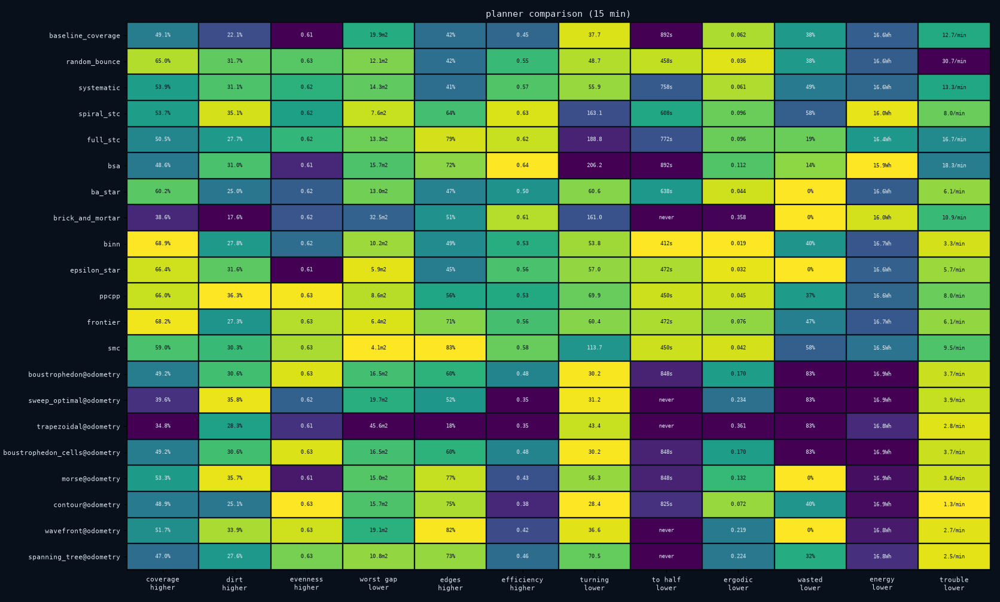
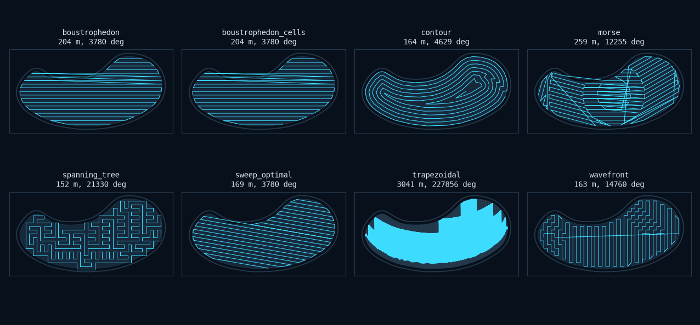

# Coverage path planning

Coverage path planning asks how to move a robot so that a tool passes over
every point of a region. It is the oldest question in cleaning robotics and the
literature is large — the most recent survey ([Shen et al.,
2026](https://arxiv.org/abs/2607.10649)) reviews 125 works and names over a
hundred algorithms.

`zimablue.planners` implements the 2D branch of it: every distinct *mechanism*,
rather than every published variant. Eighteen single-robot planners, split by
what they are allowed to know, and ten multi-robot methods on top of them --
those are in [fleets](multi-robot.md).

```python
import zimablue as zb
from zimablue.planners import PathFollower

# Online: decide the next move from what the sensors just said.
zb.Simulation(pool="kidney", controller="bsa").run(minutes=20)

# Offline: compute a whole route from the pool, then follow it.
morse = PathFollower("morse")
zb.Simulation(pool="kidney", controller=morse, expose_truth=True).run(minutes=20)
```

What is deliberately absent, and why: 3D and visual/inspection coverage,
because the backend is planar and there is no camera in the loop; and
learning-based coverage, because that is [`zimablue.rl`](ml.md), which is the
same question with the policy learned rather than written.

## Offline: given the map, compute the route

| planner | the idea |
|---|---|
| `boustrophedon` | back and forth at a fixed angle ([Choset & Pignon, 1997](references.md)) |
| `sweep_optimal` | the same, at the angle that costs least (Huang, 2001) |
| `trapezoidal` | split at every vertex, sweep each cell |
| `boustrophedon_cells` | split only where the slice's connectivity changes |
| `morse` | the same, for curved boundaries, via a Morse function |
| `contour` | follow the wall inward, offset by offset |
| `wavefront` | grid, distance transform, steepest descent |
| `spanning_tree` | cover the pool by circumnavigating a tree |

Two things are shared and worth stating once.

**Lane spacing is the swath, not a guess.** Every sweep spaces its lanes by the
cleaning width the robot actually has. A planner that used a constant would
stop being a planner and start being a shape.

**Cell order is a travelling-salesman problem.** Once a pool is cut into cells,
doing them in the order they were created means driving back and forth across
the pool between them. Nearest-neighbour with 2-opt is used throughout; exact
TSP is not worth it for twenty-odd cells.

### The decompositions are not interchangeable

On the L-shaped pool, trapezoidal decomposition cuts at every vertex and
returns 18 cells. Boustrophedon decomposition cuts only where a vertical slice
*splits or merges*, which for an L is nowhere at all, and returns 1. Both are
correct. One of them then drives eighteen separate sweeps with travel between
them, and that is the entire reason BCD was invented.

## Online: given a sensor reading, decide the next move

| controller | the idea |
|---|---|
| `spiral_stc` | grow a spanning tree of 2×2 cells, hug its perimeter (Gabriely & Rimon, 2001) |
| `full_stc` | the same, but enter cells the walls only half fill |
| `bsa` | spiral against a reference wall, then backtrack (Gonzalez, 2005) |
| `ba_star` | boustrophedon lanes, then A* to the next gap (Viet, 2013) |
| `brick_and_mortar` | seal cells behind you when it costs no connectivity (Ferranti, 2007) |
| `binn` | a shunting neural field; drive uphill (Luo & Yang, 2008) |
| `epsilon_star` | a coarse-to-fine potential; ascend a level when stuck (Song & Gupta, 2018) |
| `ppcpp` | greedy on a reward, with a short lookahead (Hassan & Liu, 2019) |
| `frontier` | always drive to the nearest thing you have not done (Yamauchi, 1997) |
| `smc` | match a distribution rather than visit a set (Mathew & Mezić, 2011) |

All nine differ in exactly one method. `OnlineCoverage` owns the EKF, the
occupancy grid, the recovery behaviour and the business of driving to a cell; a
subclass implements `choose`, which is handed the cell the robot is standing in
and returns where to go next.

That is not a convenience. If each algorithm brought its own motion layer, a
difference in coverage could always be the motion layer's fault. Here the
estimator, the grid resolution, the speeds and the bump recovery are the same
code, so a difference in the numbers is a difference in the decision rule.

### The map had to change first

The online planners drive on the map they build, and the first version of them
all covered about an eighth of a pool before declaring it finished. The reason
was not in any of the algorithms. `OccupancyMap`, which the `systematic`
controller uses to find frontiers, writes a wall the first time it sees one and
never takes it back. Three minutes of sonar echoes scattered by a drifting pose
estimate turned an eight-metre pool into **552 wall cells around 108 of floor**.

`EvidenceMap` is the fix, and both halves of it are things the robot actually
knows:

- a wall needs corroboration — three sightings before a cell counts as blocked,
  and a beam that passes *through* a cell takes a vote away;
- the robot's own footprint is proof. Wherever the hull has been is floor,
  whatever the sonar said about it earlier.

A bump switch is contact rather than an echo and counts for three votes.

### Spiral-STC's limitation is kept, not patched

Spiral-STC will not enter a 2×2 cell unless all four sub-cells are clear, so
anything the wall clips is skipped — along a curved pool wall, that is a ring
all the way round. Full-STC enters on whichever sub-cell it is stepping into.

Both are implemented, because the difference is measurable and interesting: on
a clean rectangle Spiral-STC visits every cell exactly once, which is its
theorem and is checked as one in
[`tests/test_planners.py`](../tests/test_planners.py). Chip a single sub-cell
out of the middle of that rectangle and it has to leave the spiral and come
back; Full-STC does not.

### BINN needed its equation solved rather than integrated

The neural field's dynamics are Grossberg's shunting equation, and the obvious
implementation integrates it forward. That does not work here: the excitatory
input is 100 and the decay is 8, so any Euler step large enough to propagate
activity across the grid in a few iterations overshoots the bound and rings
between the ceiling and the floor. On an even iteration count the field then
reports its *lowest* activity at exactly the cells that should be shouting
loudest. The robot paced between two cells for the entire run and covered 0.4%
of the pool.

Iterating the equilibrium instead — `x* = (BE − DI)/(A + E + I)`, damped — is
stable, still propagates, and is still a field rather than a distance
transform. BINN goes from 0.4% to the top of the table.

## Following a plan is not free

`PathFollower` drives an offline plan by pure pursuit, and it takes an argument
that decides where the robot thinks it is:

- `localisation="truth"` — the simulator's true pose. This measures **the
  route**: how good the plan is, given perfect execution. It needs
  `expose_truth` and is an upper bound, not something you could ship.
- `localisation="odometry"` — dead reckoning through the same EKF the
  `systematic` controller uses. This measures **the route plus the
  localisation**, which is what a real machine gets.

On the rectangular pool over ten minutes, `sweep_optimal` reaches 70.5% on
truth and 49.6% on odometry. Twenty-one points of the plan's value never
reaches the floor. Reading only the first number is how a planner comes to look
excellent in a paper and disappointing on a floor, and it is why
`default_entries()` uses odometry.

### The pursuit rule, and the bug in it

Pure pursuit consumes every waypoint inside a lookahead circle and aims at the
first one outside it. Getting the consumption rule wrong is subtle and cost a
rewrite. The first version advanced the waypoint index only on *arrival*
— within 18 cm — while separately aiming a lookahead distance further along.
On open floor those agree. Against a wall they do not: a plan's first waypoint
sits in a corner the hull cannot quite reach, the robot closes to 40 cm, starts
aiming at the far end of the lane instead, reverses out, finds itself more than
a lookahead from the corner again, and turns back. It paced a 15 cm stretch of
tile for the entire run at 4% coverage. There is a test named after it.

## What eighteen planners actually do

Fifteen minutes each, three pools (rectangular, kidney, L-shaped), one seed,
median across pools. Offline planners are followed on dead reckoning. A `*`
marks the best in a column.

<div align="center">

</div>

```
                                 coverage       dirt   evenness  worst gap      edges efficiency    turning    to half    ergodic     wasted     energy    trouble
------------------------------------------------------------------------------------------------------------------------------------------------------------------
baseline_coverage                   49.1%      22.1%       0.61     19.9m2        42%       0.45       37.7       892s      0.062        38%     16.6Wh   12.7/min
random_bounce                       65.0%      31.7%       0.63     12.1m2        42%       0.55       48.7       458s      0.036        38%     16.6Wh   30.7/min
systematic                          53.9%      31.1%       0.62     14.3m2        41%       0.57       55.9       758s      0.061        49%     16.6Wh   13.3/min
spiral_stc                          53.7%      35.1%       0.62      7.6m2        64%       0.63      163.1       608s      0.096        58%     16.0Wh    8.0/min
full_stc                            50.5%      27.7%       0.62     13.3m2        79%       0.62      188.8       772s      0.096        19%     16.4Wh   16.7/min
bsa                                 48.6%      31.0%       0.61     15.7m2        72%      *0.64      206.2       892s      0.112        14%    *15.9Wh   18.3/min
ba_star                             60.2%      25.0%       0.62     13.0m2        47%       0.50       60.6       638s      0.044        *0%     16.6Wh    6.1/min
brick_and_mortar                    38.6%      17.6%       0.62     32.5m2        51%       0.61      161.0      never      0.358        *0%     16.0Wh   10.9/min
binn                               *68.9%      27.8%       0.62     10.2m2        49%       0.53       53.8      *412s     *0.019        40%     16.7Wh    3.3/min
epsilon_star                        66.4%      31.6%       0.61      5.9m2        45%       0.56       57.0       472s      0.032        *0%     16.6Wh    5.7/min
ppcpp                               66.0%     *36.3%       0.63      8.6m2        56%       0.53       69.9       450s      0.045        37%     16.6Wh    8.0/min
frontier                            68.2%      27.3%       0.63      6.4m2        71%       0.56       60.4       472s      0.076        47%     16.7Wh    6.1/min
smc                                 59.0%      30.3%       0.63     *4.1m2       *83%       0.58      113.7       450s      0.042        58%     16.5Wh    9.5/min
boustrophedon@odometry              49.2%      30.6%       0.63     16.5m2        60%       0.48       30.2       848s      0.170        83%     16.9Wh    3.7/min
sweep_optimal@odometry              39.6%      35.8%       0.62     19.7m2        52%       0.35       31.2      never      0.234        83%     16.9Wh    3.9/min
trapezoidal@odometry                34.8%      28.3%       0.61     45.6m2        18%       0.35       43.4      never      0.361        83%     16.8Wh    2.8/min
boustrophedon_cells@odometry        49.2%      30.6%       0.63     16.5m2        60%       0.48       30.2       848s      0.170        83%     16.9Wh    3.7/min
morse@odometry                      53.3%      35.7%       0.61     15.0m2        77%       0.43       56.3       848s      0.132        *0%     16.9Wh    3.6/min
contour@odometry                    48.9%      25.1%      *0.63     15.7m2        75%       0.38      *28.4       825s      0.072        40%     16.9Wh   *1.3/min
wavefront@odometry                  51.7%      33.9%       0.63     19.1m2        82%       0.42       36.6      never      0.219        *0%     16.8Wh    2.7/min
spanning_tree@odometry              47.0%      27.6%       0.63     10.8m2        73%       0.46       70.5      never      0.224        32%     16.8Wh    2.5/min
```

Five things in there are worth saying out loud.

**`random_bounce` at 65% beats sixteen of the twenty other planners.** Not on a
technicality — it beats them on coverage, on the pool, in the same fifteen
minutes. Anything here that scores below it is not paying for the machinery it
carries, and that includes four planners with completeness proofs. This is the
whole reason the comparison exists.

**The three at the top are field methods, not sweeps.** `binn` (68.9%),
`frontier` (68.2%) and `epsilon_star` (66.4%) share a property: they never
commit to a route. On a pool where the map is built by bumping into things, a
plan made early is a plan made from bad information, and the methods that
re-decide every cell win.

**Turning splits the table in two, and coverage does not see it.** The STC
family turns 161–206 degrees per metre; the sweep family turns 28–37. That is
a sixfold difference in the quantity that costs a tracked machine time and
traction, between planners whose coverage numbers are five points apart.

**The worst-gap column separates planners that look identical.** `binn` and
`frontier` are within a point of each other on coverage; `binn` leaves 10.2 m²
of floor in one untouched piece and `frontier` leaves 6.4 m². Same nominal
coverage, noticeably different pool at the end of it.

**Eighty-three per cent wasted, for the planners that finish.** `boustrophedon`
and `sweep_optimal` complete their route and stop, and the run has minutes
left. That is not a bug in the planner — a finished plan *is* finished — but it
is a planner-shaped hole: the honest response is to re-plan against what the
run actually covered, and none of the classical offline methods has anything to
say about that.

The plans themselves, before anyone tried to drive them:

<div align="center">

</div>

`trapezoidal` is the outlier, and it is correct rather than broken. Trapezoidal
decomposition cuts at every vertex of the boundary, the kidney's arc chain has
534, and the result is 2893 m of driving and 225,880 degrees of turning to
cover a 54 m² pool. In fifteen minutes the robot gets through 10.7% of it.
Every later decomposition in the literature exists to avoid exactly this, and
it seemed more useful to show it than to quietly polygon-simplify it away.

## Comparing them

```python
from zimablue.planners.compare import compare
from zimablue.planners.plots import plot_comparison

result = compare(pools=("rectangular", "kidney", "l_shaped"), minutes=20, jobs=4)
print(result.table())
plot_comparison(result).savefig("planners.png")
```

or from the command line:

```bash
python examples/compare_planners.py --minutes 20 --jobs 4 --plots out/
```

Twelve measurements, and no attempt to collapse them into one:

| | |
|---|---|
| `coverage` | fraction of navigable floor the head passed over |
| `dirt` | fraction of the dirt mass removed |
| `evenness` | how uniformly it cleaned, rather than how much |
| `gap` | area of the largest patch it never went near, m² |
| `edges` | fraction of the wall the robot ran alongside |
| `efficiency` | covered area over swept area — 1.0 is a path with no overlap |
| `turning` | degrees of heading change per metre travelled |
| `half` | seconds to cover half the pool — the anytime question |
| `ergodic` | how far the time distribution is from uniform, at the end |
| `wasted` | share of the run after the ergodic score stopped improving |
| `energy` | watt-hours |
| `trouble` | collisions per minute |

Efficiency and turning are the two that catch what coverage cannot. A planner
can reach 95% by driving over everything three times, and efficiency is the
bill. Turning is what costs on real hardware and appears in almost no published
comparison.

The worst gap is there because 90% coverage means two different things. A
planner that leaves a thin margin everywhere and one that leaves a whole corner
untouched score the same, and only one of them has left a pool with a visibly
dirty end.

Four views, because one is not enough:

- **`plot_matrix`** — planners down, dimensions across, colour normalised
  within each column. Reads the *shape* of a planner rather than its rank.
- **`plot_paths`** — the trajectories side by side. Every scalar in the table
  is a summary of these.
- **`plot_curves`** — coverage against time. Two planners that finish level can
  have got there completely differently.
- **`plot_tradeoff`** — any two dimensions against each other with the Pareto
  front drawn, which is where "there is no best planner" stops being a
  disclaimer and becomes a picture.

`plot_plans` is the offline companion: the routes themselves, with their
decompositions, before anyone has tried to drive them. The difference between a
plan and the path that resulted from following it is the follower's error, and
seeing them together is the only way to tell a bad route from a badly driven
one.
